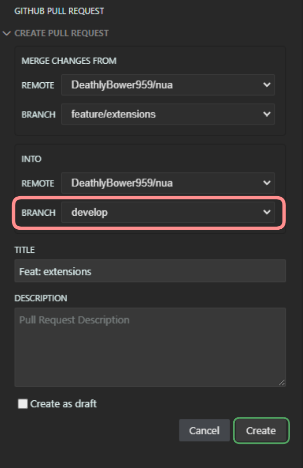

# Contributing

<!-- TODO: CONTRIBUTING.md -->

<!-- TODO: Explain git flow -->

## Git Flow

### New Feature

1. Confirm on develop branch

   ```sh
   git switch develop
   ```

2. Create a new feature branch

   ```sh
   # Git switch auto checks out to the new branch
   git switch -c feature/FEATURE-NAME
   ```

3. Push changes

   ```sh
   git add .
   git commit -m "Feat: MESSAGE"
   git push -u origin feature/FEATURE-NAME
   ```

4. Create a pull request

   

   Fill out title and description fields (and confirm the `INTO` branch is set to `develop`)

   

5. Merge pull request back into develop

   > I suggest waiting for a reviewer before merging

   Once the checks complete (preview deployment), merge the branch

   
   
   
   
